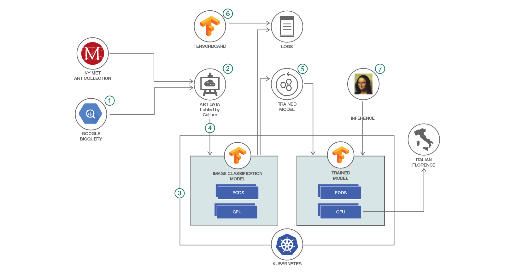

# tensorflow-kubernetes-art-classification

<!--change the repos -->

<!--change the tracking number -->

<!--Add a new Title and fill in the blanks -->
# Train a TensorFlow model on Kubernetes to recognize art culture based on the collection from the Metropolitan Museum of Art

In this developer journey, we will use Deep Learning to train an image classification model. 
The data comes from the art collection at the New York Metropolitan Museum of Art and the metadata from Google BigQuery.
We will use the Inception model implemented in TensorFlow and we will run the training on a Kubernetes cluster.  
We will save the trained model and load it later to perform inference.  
To use the model, we provide as input a picture of a painting and the model will return the likely culture, for instance Italian Florence art.
The user can choose other attributes to classify the art collection, for instance author, time period, etc.
Depending on the compute resource available, the user can choose the number of images to train, the number of classes to use, etc.
In this journey, we will select a small set of image and a small number of classes to allow the training to complete within a reasonable amount of time.
With a large data set, the training may take days or weeks.

When the reader has completed this journey, they will understand how to:

* Collect and process the data for Deep Learning in TensorFlow
* Configure Distributed TensorFlow to run on a cluster of servers
* Configure and deploy TensorFlow to run on a Kubernetes cluster
* Train an advanced image classification Neural Network
* Use TensorBoard to visualize and understand the training process

<!--Remember to dump an image in this path-->

## Flow
<!--Add new flow steps based on the architecture diagram-->
1. Register for Google BigQuery. 
2. Perform a query, select the set of arts and process the data
3. Register for the IBM Bluemix Kubernetes service. 
4. Deploy the TensorFlow pods to run the training on Kubernetes, optionally using GPU if available
5. Save the trained model and logs
6. Visualize the training with TensorBoard
7. Load the trained model in Kubernetes and run an inference on a new art drawing

<!--Leave this in if you are using a Watson service-->
## With Watson
Want to take your Watson app to the next level? Looking to leverage Watson Brand assets? Join the [With Watson](https://www.ibm.com/watson/with-watson) program which provides exclusive brand, marketing, and tech resources to amplify and accelerate your Watson embedded commercial solution.

<!--Update this section-->
## Included components
Select components from [here](components.md), copy and paste the raw text for ease
* [TensorFlow](http://www.tensorflow.org): An open-source library for implementing Deep Learning models
* [Inception model](https://github.com/tensorflow/models/tree/master/slim): an implementation of the Inception neural network for image classification
* [Google metadata for Met Art collection](https://bigquery.cloud.google.com/dataset/bigquery-public-data:the_met?pli=1): a database containing metadata for the art collection at the New York Metropolitan Museum of Art
* [Met Art collection](link): a collection of over 200,000 public art artifacts, including paintings, books, etc.
* [Kubernetes](https://kubernetes.io): an open-source system for orchestrating containers on a cluster of servers 
* [IBM Bluemix Container Service](https://console.ng.bluemix.net/docs/containers/container_index.html?cm_sp=dw-bluemix-_-code-_-devcenter): a public service from IBM that hosts users applications on Docker and Kubernetes 

<!--Update this section-->
## Featured technologies
Select components from [here](technologies.md), copy and paste the raw text for ease
* [TensorFlow](https://www.tensorflow.org): Deep Learning library
* [TensorFlow models](https://github.com/tensorflow/models/tree/master/slim): public models for Deep Learning
* [Kubernetes]():  Container orchestration 

<!--Update this section when the video is created-->
# Watch the Video

#
<!--Include any troubleshooting tips (driver issues, etc)-->

# Troubleshooting

* Error: Environment {GUID} is still not active, retry once status is active

  > This is common during the first run. The app tries to start before the Discovery
environment is fully created. Allow a minute or two to pass. The environment should
be usable on restart. If you used `Deploy to Bluemix` the restart should be automatic.

* Error: Only one free environent is allowed per organization

  > To work with a free trial, a small free Discovery environment is created. If you already have
a Discovery environment, this will fail. If you are not using Discovery, check for an old
service thay you may want to delete. Otherwise use the .env DISCOVERY_ENVIRONMENT_ID to tell
the app which environment you want it to use. A collection will be created in this environment
using the default configuration.

<!--keep this-->

# License
[Apache 2.0](LICENSE)

<!--This can stay as-is if using Deploy to Bluemix-->

# Privacy Notice
If using the `Deploy to Bluemix` button some metrics are tracked, the following
information is sent to a [Deployment Tracker](https://github.com/IBM-Bluemix/cf-deployment-tracker-service) service
on each deployment:

* Node.js package version
* Node.js repository URL
* Application Name (`application_name`)
* Application GUID (`application_id`)
* Application instance index number (`instance_index`)
* Space ID (`space_id`)
* Application Version (`application_version`)
* Application URIs (`application_uris`)
* Labels of bound services
* Number of instances for each bound service and associated plan information

This data is collected from the `package.json` file in the sample application and the `VCAP_APPLICATION` and `VCAP_SERVICES` environment variables in IBM Bluemix and other Cloud Foundry platforms. This data is used by IBM to track metrics around deployments of sample applications to IBM Bluemix to measure the usefulness of our examples, so that we can continuously improve the content we offer to you. Only deployments of sample applications that include code to ping the Deployment Tracker service will be tracked.

## Disabling Deployment Tracking

To disable tracking, simply remove ``require("cf-deployment-tracker-client").track();`` from the ``app.js`` file in the top level directory.
